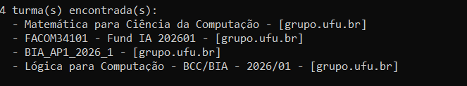
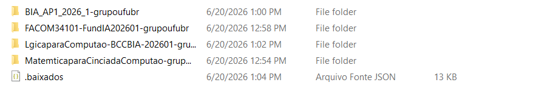
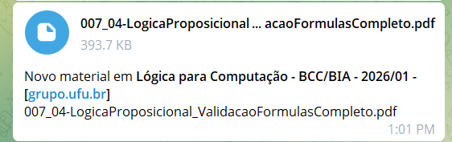
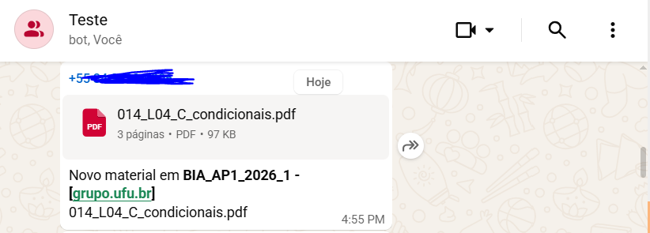

# UFU Monitor

Script que monitora automaticamente os materiais de aula postados no Microsoft Teams e Moodle da UFU, salva os novos materiais no computador e envia uma notificação com o arquivo no Telegram e/ou WhatsApp.

## Demonstração






## Como funciona

No primeiro uso, abre um browser para login na conta institucional da UFU, o playwright salva o perfil de sessão localmente.

A partir daí o script roda em loop, verificando a cada x segundos se há arquivos novos nas turmas.

A autenticação com o sharepoint é feita via jwt e o script intercepta o token nas requisições do browser, monitora o tempo de expiração e renova antes de vencer.

O script Moodle usa a api do aplicativo e faz login com usuário e senha para obter um wstoken, que é salvo em cache e reutilizado nas próximas execuções. Com o token, ele consulta as disciplinas matriculadas, percorre as seções de cada disciplina e coleta os arquivos dos módulos.
## Requisitos

- Python 3.10+
- Node.js 18+
- [Playwright](https://playwright.dev/python/)

```bash
pip install requests playwright
playwright install chromium
```

## Configuração

Edite as variáveis no topo dos arquivos `ufu_teams.py` e `ufu_moodle.py`:

```python
intervalo_watch = 300       # intervalo entre verificações em segundos
margem_renovar  = 10       # renova o token X minutos antes de expirar
pasta_base      = ...      # onde os arquivos serão salvos (padrão: ./UFU_Teams)


telegram_ativo   = True                  # False para desativar notificações
whatsapp_ativo   = True                  # False para desativar notificações pelo WhatsApp

minhas_turmas = []  # deixe vazio para detectar automaticamente

moodle_usuario = os.environ.get("MOODLE_USUARIO", "")  #user do moodle
moodle_senha   = os.environ.get("MOODLE_SENHA",   "")  #senha do moodle                  


```


## Uso

```bash
python ufu_teams.py
python ufu_moodle.py
```

No primeiro uso do monitor Teams, um browser abre para login. Após o login, o perfil é salvo em `./ufu_perfil` e o script começa a monitorar automaticamente.


## Notificações via WhatsApp

O envio pelo WhatsApp usa um servidor local Node.js baseado na biblioteca `whatsapp-web.js`.

### 1. Instalar dependências do servidor

```bash
cd whatsapp-web.js
set PUPPETEER_SKIP_DOWNLOAD=true
npm install
npm install qrcode-terminal express
```

### 2. Iniciar o servidor WhatsApp

```bash
node whatsapp_server.js
```

### 3. Escanear o QR code do console

Um QR code será exibido no terminal. Abra o WhatsApp no celular e escaneie (o login não é persistente, então, se o CMD for fechado, será necessário escanear o QR code novamente).


### 4. Descobrir o ID do grupo

Com o servidor rodando e conectado, acesse no navegador:

```
http://localhost:3737/grupos
```

Será retornada uma lista com o nome e o ID de cada grupo. Copie o ID do grupo desejado (formato: `120363xxxxxxxxxx@g.us`).

### 5. Configurar o número/grupo no Python

Defina a variável de ambiente `WHATSAPP_NUMERO` com o ID do grupo ou número:

```python
# Em ufu_teams.py e ufu_moodle
whatsapp_numero = os.environ.get("WHATSAPP_NUMERO", "")
# Exemplo: "120363xxxxxxxxxx@g.us"
```

> **Atenção:** inicie o servidor Node (`node whatsapp_server.js`) antes de rodar o script Python.


## Notificações via Telegram


### 1. Configurar no Python

Defina as variáveis de ambiente `TELEGRAM_TOKEN` e `TELEGRAM_CHAT_ID`:

```python
# Em ufu_teams.py e ufu_moodle.py
telegram_token   = os.environ.get("TELEGRAM_TOKEN", "")
telegram_chat_id = os.environ.get("TELEGRAM_CHAT_ID", "")
```

> **Atenção:** arquivos acima de 49 MB recebem apenas uma mensagem de texto (limite da Bot API do Telegram).


## Estrutura de arquivos gerada

```
UFU_Teams/
├── NomeDaTurma-grupoufubr/
│   ├── 001_aula1.pdf
│   ├── 002_PlanoDeEnsino.pdf
│   └── 003_aula2.pptx
├── OutraTurma-grupoufubr/
│   └── 001_material.pdf
└── .baixados.json       ← controle de arquivos já baixados

UFU_Moodle/
├── 13572/               ← id da disciplina
│   ├── 001_Aula 00 - Apresentação da disciplina.pdf
│   ├── 002_Aula 01 - Representação de dados.pdf
│   └── 003_Lista de Exercícios 1.pdf
└── .baixados.json       ← controle de arquivos já baixados
```


## Extensões monitoradas

`.pdf` `.pptx` `.ppt` `.docx` `.doc` `.xlsx` `.zip` `.txt`